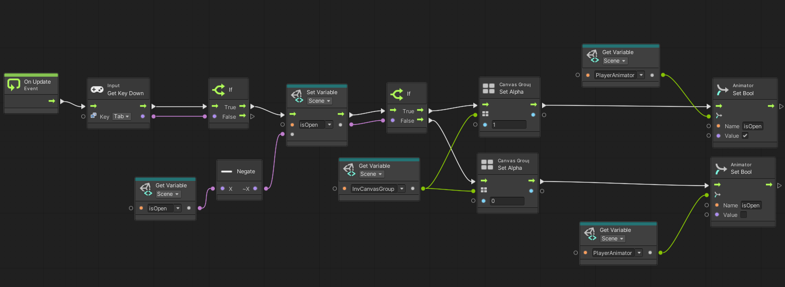

# GDIM33 Vertical Slice
## Milestone 1 Devlog
1. One of the main Visual Scripting graphs in the vertical slice manages the inventory open/close state using a Scene Variable called isOpen. When the player presses Tab,
   a button event in the graph reads the current boolean value of isOpen. If it is true, the graph flips it and writes the updated value back to the scene. It also toggles
   the inventory UI visibility by adjusting the alpha level of the Canvas Group. The isOpen variable is referenced by other systems as well: when the inventory is open, the
   camera smoothly lerps to a dedicated inventory view position, similar to how Animal Crossing frames its inventory screen.
   
2. The state machine used in the vertical slice is the player animation state machine. The animator has three paramaters: the float speed, float directionZ and the boolean
   isChopping. The machine has three main states, walk/run, chop, and idle. The player animator script calculates the horizontal movement, comparing it to the character
   controller position and feeds that information to the speed and directionZ variable. If the player is moving backwards, the directionZ variable goes negative, which
   triggers the animator to play the reverse walking animation. The isChopping boolean is controlled by a player interaction script. The boolean is set to true when the
   player holds the "E" key near a tagged tree or rock environment object, it resets to false when the key is released. This chopping state can be triggered at any time as
   long as the player meets the conditions. The walk animation is triggered when the player's speed exceeds 0. The running animation can be triggered when the player speed
   exceeds 5, this only happens when the player is holding down the shift key. The default state when the player stops moving is set to idle.

   The state machine connects directly to two other systems in the game. It ties into the interaction and inventory systems through the Chop state, which plays for as long as the
   progress bar is filling. When the player holds "E" near a resource in the environment, the interaction system locks the Animator into the Chop state and keeps it there while the
   action progresses. The progress bar and the animation stay in sync throughout, reflecting the same resource chopping timer. Once the action completes, the inventory system receives 
   the resource, either wood or stone depending on what was targeted and then the Chop state exits, returning the Animator to Idle. If the player cancels early by releasing the key or 
   stepping away, the state machine resets immediately.

   
   
## Milestone 2 Devlog
1.  Feature: Campfire Placement & Interaction System

The campfire is the central survival mechanic in my vertical slice. The player must gather wood and stone, craft a campfire item through the inventory, select it, and physically place it in the world. Once placed, they can walk up to it, open a dedicated UI, add fuel to keep it burning, and upgrade the shelter level to improve warmth radius over the three-night survival period.

Step 1 — Crafting the campfire as an inventory item
- Design the campfire as a craftable item that lives in the player's inventory like any other resource
- Set up the recipe system so the campfire can be unlocked through gathering and crafting
- Make the campfire distinguishable from regular items so the game knows it can be placed in the world

Step 2 — Placing the campfire in the world

- Give the player a way to enter placement mode when a placeable item is selected
- Provide visual feedback showing where the campfire will be placed and whether the location is valid
- Confirm the placement and remove the item from inventory once committed

Step 3 — Campfire interaction UI

- Build a status panel that shows the campfire's current state and lets the player interact with it
- Connect player actions (adding fuel, upgrading shelter) to meaningful changes in the game world
- Tie the campfire UI into the existing inventory system so both panels open together seamlessly
 
2.  The task breakdown was genuinely useful for the campfire feature because it forced me to separate what felt like one big feature into three distinct systems: crafting, placement, and the interaction. Without that separation I probably would have tried to wire everything up at once and gotten confused about where state lived. If I were to improve the breakdowns, I would add notes about dependencies between steps, for example, Step 2 can't be tested until Step 1 produces a valid item in inventory, and Step 3's UI callbacks can't be wired until the prefab exists from Step 2. Calling those dependencies out explicitly would help avoid dead ends mid-build.

3. My vertical slice bridges Visual Scripting and C# scripts with shared scene variable called isOpen.  The VS graph runs on On Update Event and detects when Tab is pressed via Get Key Down. It reads isOpen via Get Variable (Scene), negates it, and writes the flipped value back with Set Variable, toggling the inventory open and closed. A second If branch then checks the new state to set the InvCanvasGroup alpha (showing or hiding the inventory UI) and sets an isOpen bool on the PlayerAnimator via Animator Set Bool to freeze or resume animations.

On the C# side, UIManager.cs, CampfireInteraction.cs, and CampfirePlacer.cs all write to the same isOpen Scene Variable when panels open or close. This means the graph responds regardless of whether the UI state was triggered by Tab, C, or Q — it just reads the one shared variable. PlayerController.cs also disables the ScriptMachine component directly as a failsafe to fully stop the graph when any UI is open.

4. Please grade the Campfire Placement and Interaction System. The player crafts a campfire from the inventory Recipes panel (Tab), selects it with a number key, presses Q to enter a ghost placement mode, and left-clicks to place it. Walking up to the placed campfire and pressing C opens the campfire status panel (fuel bar, shelter level, add fuel and upgrade shelter buttons) alongside the shared backpack/crafting panel. 

## Milestone 3 Devlog
Milestone 3 Devlog goes here.
## Milestone 4 Devlog
Milestone 4 Devlog goes here.
## Final Devlog
Final Devlog goes here.
## Open-source assets
- [Animations](https://kaylousberg.itch.io/kaykit-character-animations) 
- [Environment](https://kaylousberg.itch.io/kaykit-forest) 
- [Objects](https://kaylousberg.itch.io/resource-bits) 
- [Player](https://kaylousberg.itch.io/kaykit-character-animations) 
- [Camping Objects](https://forsunka.itch.io/low-poly-camping-asset)

